# FEA E-Motor Winding Automated Design and Optimisation Framework

A Python-based simulation automation framework for **electric motor winding design, finite element analysis (FEA), and optimisation**.

This project was developed from my PhD research on **algorithmically designed and additively manufactured electric motor windings**. It automates the generation, simulation, and optimisation of winding geometries using **Ansys Maxwell**, **Ansys OptiSLang**, **Ansys Motor-CAD**, and **Ansys Electronics Desktop**, combining geometry generation, Maxwell VBScript automation, FEA result extraction, and optimisation feedback into a repeatable engineering workflow.

---

## Workflow overview

<p align="center">
  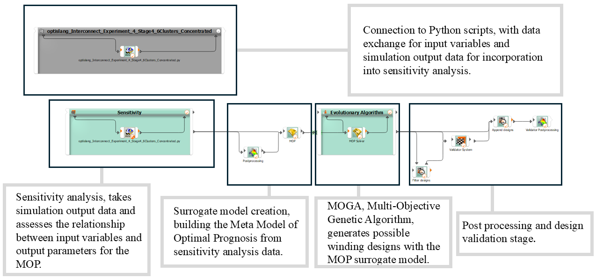
</p>

The automation workflow links OptiSLang, Python, and Ansys Maxwell into a closed-loop optimisation process. Python interconnect scripts receive design variables from OptiSLang, build structured conductor geometry inputs, call experiment workflows, generate Maxwell VBScript automation, launch simulations, extract loss and torque outputs, and return objective values for sensitivity analysis, surrogate modelling, and multi-objective optimisation.

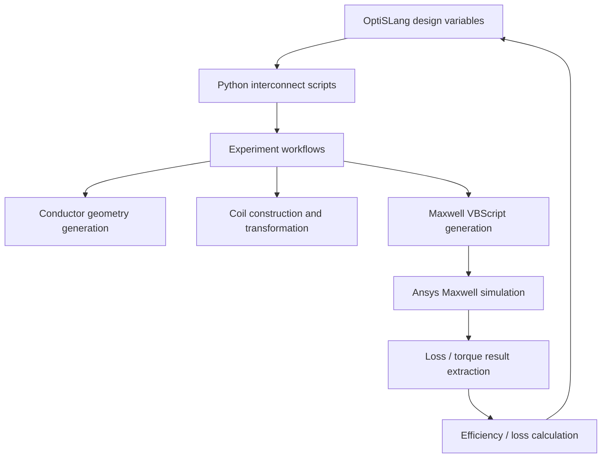

---

## Overview

Designing and evaluating electric motor winding layouts manually inside an FEA tool is slow, repetitive, and difficult to scale to large optimisation studies. This framework was built to automate that process.

The original research workflow connected:

```text
OptiSLang
→ Python automation scripts
→ parametric conductor geometry generation
→ Maxwell VBScript automation generation
→ Ansys Maxwell FEA simulation
→ result extraction
→ sensitivity analysis and metamodel training
→ genetic algorithm optimisation
```

The goal was to replace repeated manual FEA setup with a reproducible automated workflow capable of exploring large winding design spaces. During the PhD work, the framework supported **sensitivity analysis, surrogate model training, and multi-objective optimisation** across a large number of candidate winding configurations.

---

## Engineering problem

The project was developed to automate the exploration of **electric motor stator winding geometries** and reduce the amount of manual FEA setup required for each simulation.

The automation framework supports:

- generating conductor layouts within slot boundaries
- varying conductor **shape**, **scale**, **position**, **rotation**, and **layer configuration**
- creating complete **coil geometries** for Maxwell simulation
- automatically generating Maxwell automation scripts
- running simulation batches and collecting losses / torque outputs
- returning performance metrics for optimisation studies

This enabled large-scale winding design exploration using a combination of **high-fidelity FEA**, **sensitivity analysis**, **surrogate modelling**, and **genetic algorithms**. Across the wider research programme, the workflow was used to generate over **25,000 unique FEA models** and explore more than **300,000 winding design iterations**.

<p align="center">
  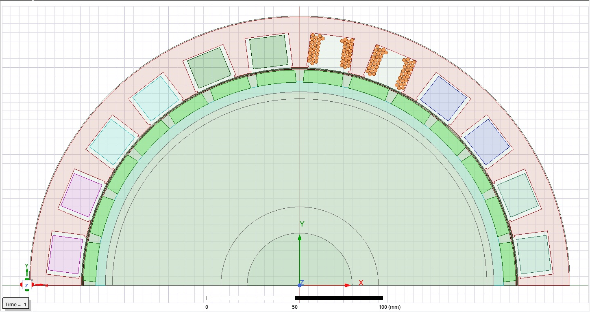
</p>

The hybrid motor model above shows the wider simulation context in which the generated winding configurations are embedded. Candidate conductor arrangements are first generated within slot boundaries, then transferred into the Maxwell motor model for electromagnetic analysis and loss evaluation.

---

## Example winding layouts

The repository currently contains two representative refactored optimisation workflow families:

- **Orderly Stage 2** — orderly conductor placement workflow
- **Layered Stage 5** — layered conductor arrangement and rotation optimisation workflow

These layouts illustrate the range of conductor packing strategies explored by the optimisation framework, including mixed-shape conductor populations, structured layered arrangements, and different slot-filling patterns.

### Mixed-shape generated winding configurations

<p align="center">
  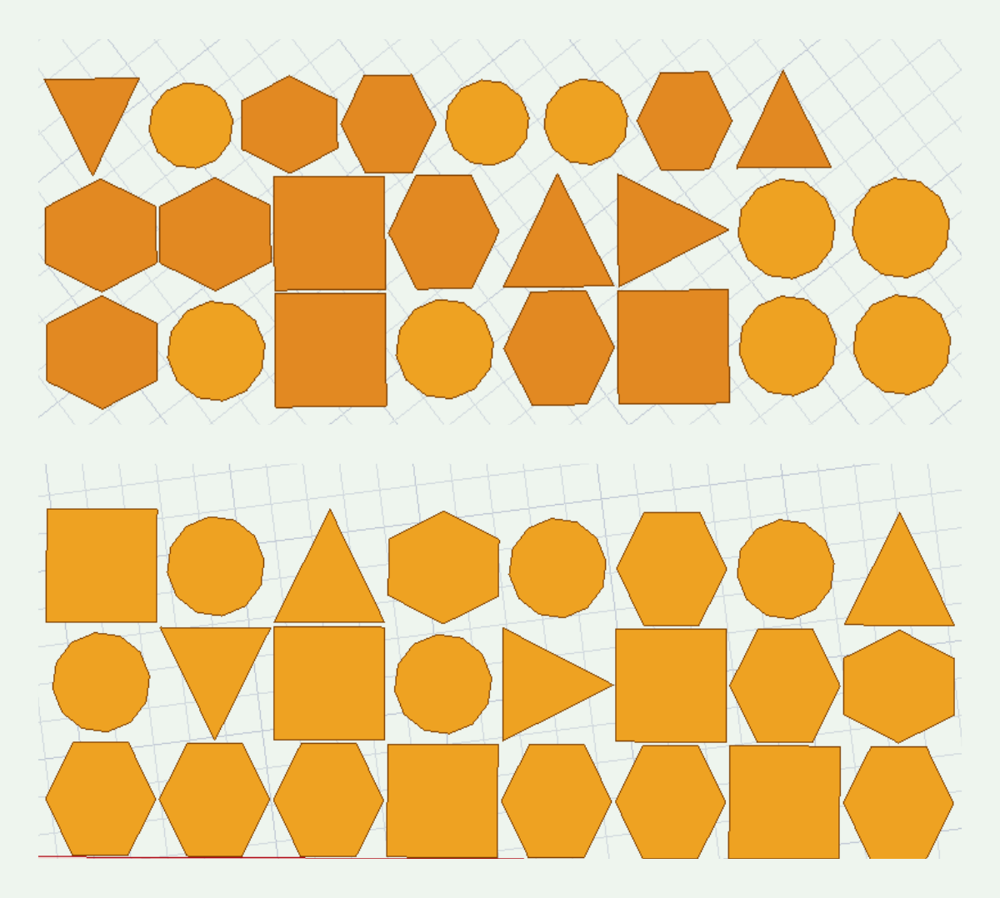
</p>

<p align="center">
  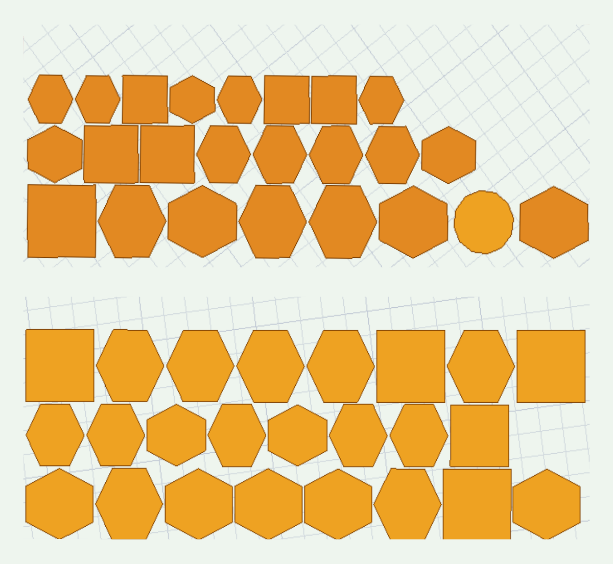
</p>

### Structured / layered winding configuration example

<p align="center">
  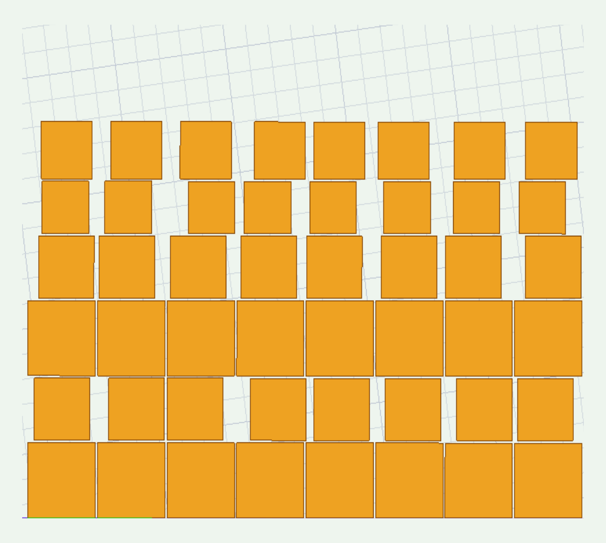
</p>

---

## Architecture

The repository is organised around a Python-driven workflow that connects OptiSLang interconnect scripts, experiment logic, Maxwell automation generation, and simulation result processing.

<p align="center">
  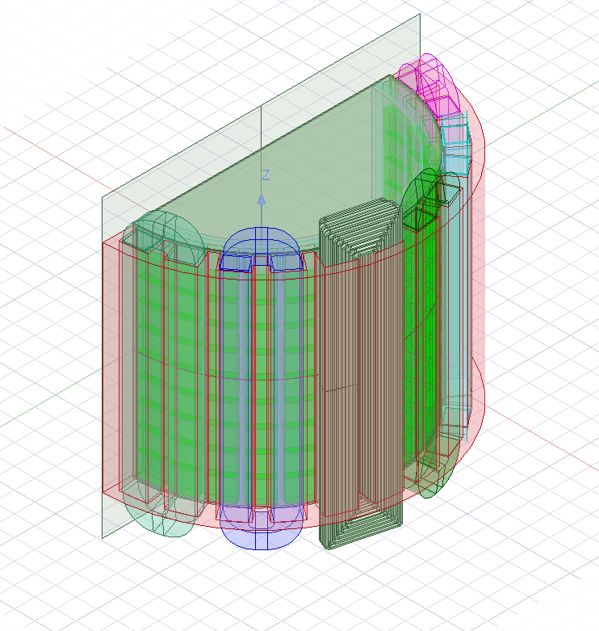
</p>

```mermaid
flowchart LR
    A[OptiSLang proposes new design variables] --> B[Python interconnect assembles arrays]
    B --> C[Experiment workflow builds slot geometry]
    C --> D[VBScript generated for Maxwell]
    D --> E[Maxwell simulation executed]
    E --> F[Torque and loss results exported]
    F --> G[Python calculates machine efficiency and losses]
    G --> H[Objective values returned to OptiSLang]
```

### Architecture summary

```text
optislang/
    Interconnect scripts that receive design variables from OptiSLang
    and pass structured arrays into experiment workflows

experiments/
    Core experiment workflows that generate geometry, create coils,
    build Maxwell automation scripts, run simulations, and compute objectives

maxwell/
    Maxwell VBScript generation utilities

data/
    Output directory handling, simulation counters, and Excel / CSV result I/O

legacy/
    Original PhD research scripts preserved for traceability and reference

tests/
    Pytest tests for refactored modules and representative workflows
```

---

## Repository structure

```text
src/motoropt/
├── data/
│   ├── directory_manager.py
│   ├── simulation_counter.py
│   └── excel_io.py
│
├── maxwell/
│   └── vbscript_generator.py
│
├── experiments/
│   ├── orderly_stage2_experiment.py
│   └── layers_stage5_experiment.py
│
├── optislang/
│   ├── orderly_stage2_interconnect.py
│   └── layers_stage5_interconnect.py
│
├── geometry/
└── visualisation/

tests/
├── test_directory_manager.py
├── test_simulation_counter.py
├── test_excel_io.py
├── test_vbscript_generator.py
├── test_orderly_stage2_interconnect.py
├── test_orderly_stage2_experiment.py
├── test_layers_stage5_interconnect.py
└── test_layers_stage5_experiment.py

legacy/
├── data/
├── experiments/
├── maxwell/
├── optislang/
└── notes/

docs/
└── images/
    ├── optislang_workflow_overview.png
    ├── hybrid_motor_model.png
    ├── generated_winding_layout_1.png
    ├── generated_winding_layout_2.png
    ├── structured_winding_layout.png
    ├── full_motor_model_3d.png
    ├── loss_density_slot_detail.png
    ├── loss_density_full_machine.png
    └── optimisation_result_scatter.png

examples/
├── generated_vbs/
│   ├── sample_orderly_stage2.vbs
│   └── sample_layers_stage5.vbs
└── sample_outputs/
    ├── sample_simulation_results.xlsx
    ├── sample_objective_outputs.xlsx
    └── sample_summary.csv
```

---

## Refactored components

The `src/motoropt/` package contains cleaned, testable versions of selected modules from the original research code.

### Data utilities

#### `directory_manager.py`

Creates simulation output folders using stage names and simulation / coil identifiers.

#### `simulation_counter.py`

Reads, creates, and updates the `.ini` counter file used to track simulation numbering.

#### `excel_io.py`

Handles result extraction and spreadsheet export used throughout the workflow.

---

### Maxwell automation

#### `vbscript_generator.py`

Generates Visual Basic automation scripts for Maxwell. The order of Maxwell commands is intentionally preserved because the automation is sensitive to execution sequence.

---

### Refactored representative workflows

#### `orderly_stage2_experiment.py`

Refactored experiment workflow for an **orderly conductor placement** optimisation stage.

#### `orderly_stage2_interconnect.py`

OptiSLang interconnect for the Orderly Stage 2 experiment.

#### `layers_stage5_experiment.py`

Refactored experiment workflow for a **layered winding configuration** optimisation stage.

#### `layers_stage5_interconnect.py`

OptiSLang interconnect for the Layered Stage 5 experiment.

These representative workflows were selected to demonstrate how the original research scripts can be transformed into cleaner, testable software modules without losing the underlying engineering logic.

---

## Example artefacts

Representative workflow artefacts are included in the `examples/` directory to show the kinds of files produced by the automation pipeline without requiring the full original research archive.

### Generated Maxwell automation scripts

The `examples/generated_vbs/` folder contains representative **generated Maxwell VBScript automation files**. These illustrate the kind of scripted geometry creation, setup, and simulation control generated by the Python workflow before being executed inside Ansys Maxwell.

Typical contents include:

- generated conductor and coil geometry construction commands
- Maxwell material / setup / analysis definitions
- commands for simulation execution and export of results

### Representative simulation and optimisation outputs

The `examples/sample_outputs/` folder contains **representative output files** exported by the workflow, such as:

- simulation result spreadsheets
- optimisation objective / response outputs
- summary CSV files used for post-processing or review

These example artefacts are included to make the repository easier to understand from an engineering-software perspective and to show the intermediate files produced by the workflow beyond the Python source code alone.

---

## Example simulation outputs

The generated winding layouts are evaluated inside Maxwell to assess electromagnetic losses, efficiency, and performance trade-offs. The images below show representative slot-level and full-machine outputs from the broader research workflow.

### Slot-level conductor loss distribution

<p align="center">
  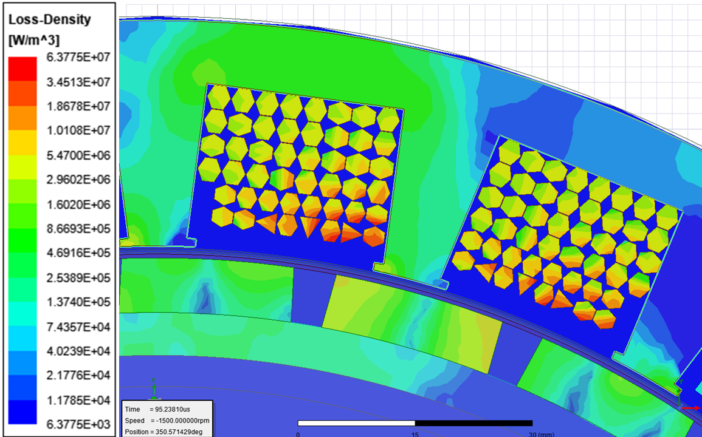
</p>

### Full-machine electromagnetic loss distribution

<p align="center">
  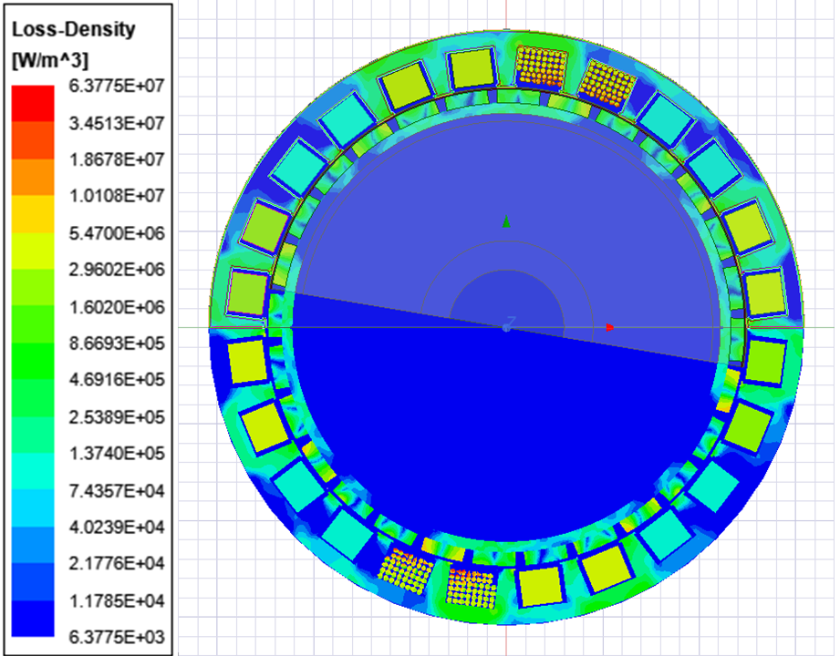
</p>

### Example optimisation result space

<p align="center">
  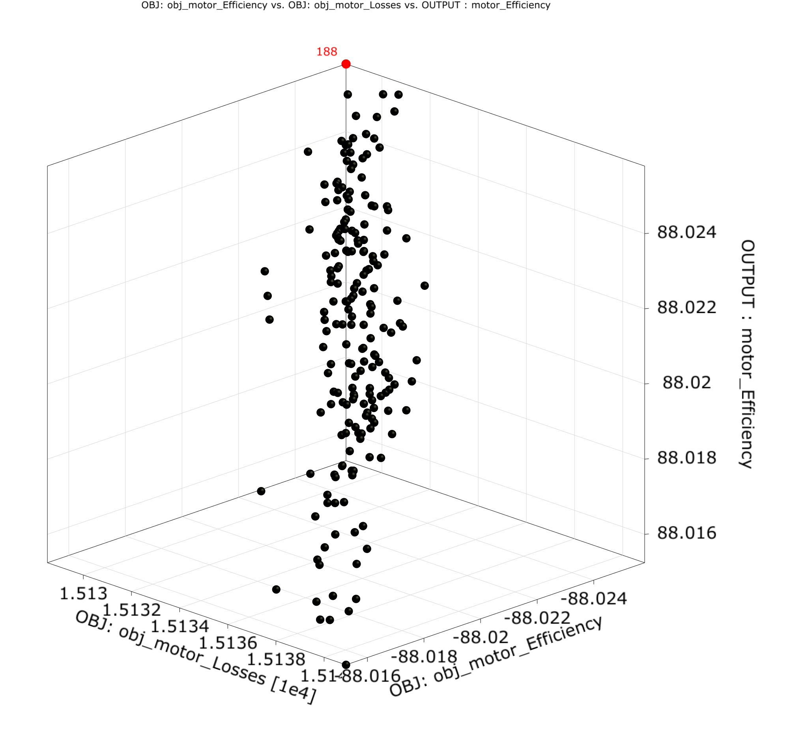
</p>

---

## Why the `legacy/` folder is included

The `legacy/` directory contains the original PhD research scripts before refactoring.

These are intentionally preserved because they show the historical research implementation and provide traceability between the original automation workflow and the cleaned modules in `src/motoropt/`. The refactored modules in `src/motoropt/` are not intended to replace the entire historical codebase one-to-one; instead, they provide **representative, maintainable examples of the main workflow components**.

---

## Testing

This repository uses `pytest`.

Run all tests from the repository root:

```bash
pytest
```

Run an individual test file:

```bash
pytest tests/test_layers_stage5_experiment.py
```

The tests cover:

- directory creation and naming
- simulation counter handling
- Excel / CSV result handling
- Maxwell VBScript generation
- representative OptiSLang interconnect behaviour
- representative experiment workflow execution without launching Maxwell

The experiment tests use mocking to avoid running Ansys Maxwell during unit testing.

---

## Technologies used

- **Python 3.11**
- **pytest**
- **pandas**
- **shapely**
- **pathlib**
- **configparser**
- **matplotlib**
- **Ansys Maxwell** automation via generated VBScript
- **Ansys OptiSLang** workflow integration
- **Ansys Motor-CAD**
- **Ansys Electronics Desktop**

---

## Research context

This repository is based on automation tooling developed during my PhD research into electric motor winding design, optimisation, and advanced manufacturing.

The focus of the repository is the **software framework and workflow automation**, rather than the complete research dataset or every historical simulation artefact. Large generated simulation outputs, Maxwell project files, and optimisation result archives are intentionally excluded.

---

## Related research outputs

This repository was developed from automation tooling created during my PhD research into electric motor winding design, optimisation, and advanced manufacturing. The following papers provide the engineering and research context behind the workflows implemented in this repository:

- **The Design and Optimization of Additively Manufactured Windings Utilizing Data Driven Algorithms for Minimal Loss in Electric Machines** — *IEEE Access, 2024*  
  Describes the winding design and optimisation methodology underpinning this repository, including algorithmic winding generation, automated optimisation using Ansys OptiSLang, and validation of low-loss additively manufactured winding designs.  
  [Read on IEEE Xplore](https://ieeexplore.ieee.org/document/10772096)

- **Power Loss Observations in Algorithmically Designed Additively Manufactured Stator Windings** — *IEEE, 2025*  
  Presents follow-on experimental and analytical observations on loss behaviour in algorithmically generated additively manufactured stator windings, directly connected to the winding geometry and simulation workflows used in this repository.  
  [Read on IEEE Xplore](https://ieeexplore.ieee.org/document/10870222)

---

## Current status

The repository currently contains:

- preserved legacy research scripts from the original PhD workflow
- refactored data and automation modules
- two representative refactored optimisation workflow pairs
- unit tests covering the refactored components

The aim of the repository is to demonstrate how research-grade engineering automation code can be **cleaned, structured, tested, and documented** as a maintainable software project while preserving the underlying engineering workflow and research context.

---

## Future improvements

Possible future additions include:

- example generated Maxwell VBScript files
- additional refactored geometry utilities
- example optimisation datasets / screenshots of results
- expanded documentation for experiment families and optimisation stages
